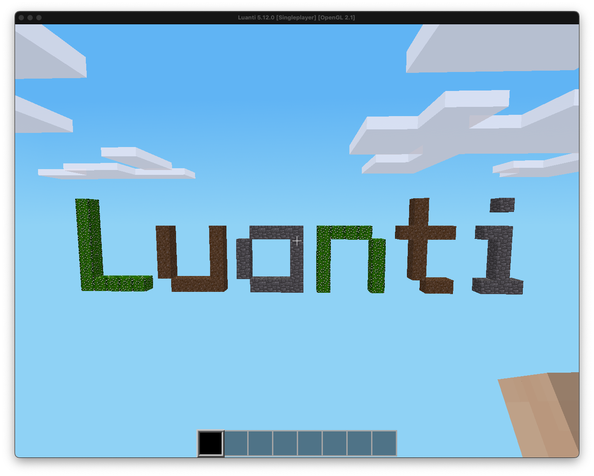

# Luanti MapBlock Codec

A collection of Python tools to encode and decode individual Minetest/Luanti MapBlocks. A **MapBlock** is a 16x16x16 chunk of the world, consisting of 4096 individual **nodes**. A node is the minimal destructible unit in the game world.

This project provides scripts to both **encode** a single MapBlock into its compressed format and **decode** a compressed MapBlock to inspect its contents. The target map format version is 29.


## Core Capabilities

This repository provides two main functionalities at the MapBlock level:

- **MapBlock Encoding**: Generate a single, compressed MapBlock from a list of nodes and their positions.

- **MapBlock Decoding**: Decompress and parse a single, compressed MapBlock to inspect its raw data, view node contents, and analyze its structure programmatically.

The included example script (`createMapSqlite.py`) demonstrates how to use the single MapBlock encoder to generate a complete `map.sqlite` file for a world.

## Modules

| Module               | Description                                                             |
| -------------------- | ----------------------------------------------------------------------- |
| `mapBlockEncode.py`  | Encodes and compresses a list of nodes into a single MapBlock.          |
| `mapBlockDecode.py`  | Decompresses and parses a single MapBlock to inspect its contents.      |
| `encode_position.py` | Encodes MapBlock coordinates into the format used by Minetest.          |
| `decode_position.py` | Decodes the position from the database back into (x, y, z) coordinates. |

## Requirements

- Python 3.10.13
- zstandard 0.23.0
- uv CLI
- Minetest/Luanti client that understands map format 29 (e.g. version 5.12.0)

## Quick Start: Generating a Map Database

The following steps show how to use the example script to generate a `map.sqlite` file from a simple text pattern.

```bash
git clone https://github.com/chenxu2394/Luanti-MapBlock-Codec.git
cd Luanti-MapBlock-Codec

uv python install 3.10.13
uv venv --seed
source .venv/bin/activate        # Windows: .venv\Scripts\activate
uv pip sync uv.lock
uv pip install -e .
```

### **The Pattern File**

To generate a map, you need a pattern file. Each line in this file defines a single node using the format `(x, y, z) material`, where `x`, `y`, and `z` are integer coordinates and `material` is the node's name.

For example:

```bash
# The sample pattern draws the Luanti logo.
# Letter L
(0,50,0) cactus
(1,50,0) cactus
(2,50,0) cactus
(3,50,0) cactus
(4,50,0) cactus
...

# Letter u
(7,50,0) dirt
(8,50,0) dirt
(9,50,0) dirt
(10,50,0) dirt
...
```

### **Build the Luanti logo example**

```bash
cd example
python createMapSqlite.py
```

The script reads `pattern_logo.txt`, groups the nodes by their respective MapBlocks, encodes each MapBlock individually, and creates `map.sqlite` in the same directory.

### **Load into Minetest**

0. Open Luanti and install the `Minetest Game`
1. Create a new _singlenode_ world.
2. Overwrite the world’s `map.sqlite` with the generated file:
   `cp example/map.sqlite /path/to/minetest/worlds/<world_name>/map.sqlite`
3. Start the world. The Luanti logo appears at the spawn point (one may want to set the `fly` privilege as shown [in this repo](https://github.com/chenxu2394/liblsqecc-minetest?tab=readme-ov-file#32-locate-and-modify-the-minetestconf-file)).

### **Custom patterns**

Edit `pattern_logo.txt` or supply another file with the same `(x, y, z) material` syntax, then edit `pattern_filename` and rerun `createMapSqlite.py`.
